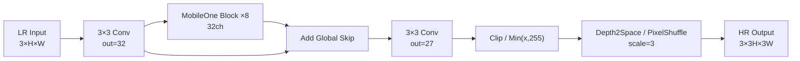

# RK3588 MobileOne + Skip + Depth2Space/PixelShuffle 超分落地方案

**生成日期**: 2026-06-26
**任务**: 540p → 1080p 3× 单图超分（SISR）
**目标平台**: RK3588 RKNPU（INT8）
**参考方案**: Mobile AI 2025 冠军 AntSR + Mobile AI 2026 AIO MAI 论文

---

## 1. 目标规格

| 项目      | 目标值                                       |
| --------- | -------------------------------------------- |
| 任务      | 3× SISR，540×960 → 1080×1920                 |
| 目标平台  | RK3588 RKNPU（INT8）                         |
| 模型大小  | <100 KB                                      |
| 训练框架  | PyTorch + `torch.quantization`               |
| 部署链路  | PyTorch → ONNX → RKNN-Toolkit2 → `.rknn`     |
| 目标延迟  | <30 ms @ RK3588 NPU                          |
| 目标 PSNR | ≥29.8 dB on DIV2K val（对齐 MAI 2025 AntSR） |
| 量化损失  | FP32→INT8 PSNR drop <0.1 dB                  |

---

## 2. 网络结构设计

采用 AntSR/AIO MAI 的 extract–refine–upsample 思想，将 RepConv 升级为 **MobileOne-style** 重参数化块，融合后等价于单 3×3 卷积，对 RKNPU 更友好。



### 2.1 MobileOne Block（训练时）

- 4 条 3×3 卷积分支
- 1 条 1×1 卷积分支
- 1 条 identity 分支
- 每条激活分支后接 BN
- 求和后接 ReLU

### 2.2 推理时

所有分支融合为单 3×3 Conv + BN + ReLU，等价于普通卷积层。

### 2.3 关键设计选择

- 通道数 `C=32`，块数 `N=8`，参考 AIO MAI 论文
- 使用 **Depth2Space** 作为上采样（TensorFlow 命名），PyTorch 中等价于 `nn.PixelShuffle(3)`
- 输出前加 **Clip / Min(x, 255)**，与 AntSR 一致，防止 INT8 溢出
- 添加 **global feature skip**：`f = f_N + f_0`，缓解量化损失、加速收敛

---

## 3. 训练三阶段流程

### 3.1 Stage 1：浮点基础训练

| 配置       | 值                   |
| ---------- | -------------------- |
| Loss       | L1                   |
| Epoch      | 600                  |
| LR         | 1e-3，cosine decay   |
| Optimizer  | Adam，β=(0.9, 0.999) |
| Batch Size | 16                   |
| LR Patch   | 128×128              |
| Data Aug   | H/V flip，transpose  |

**目标**：获得稳定的浮点基线，PSNR ~30.0 dB。

### 3.2 Stage 2：Fidelity 精调 + 教师蒸馏

| 配置       | 值                                              |
| ---------- | ----------------------------------------------- |
| Loss       | Charbonnier + λ_dct·L_DCT + λ_kd·L_KD           |
| Epoch      | 200                                             |
| LR         | 3e-5                                            |
| Batch Size | 16                                              |
| LR Patch   | 160×160                                         |
| λ_dct      | 0.02                                            |
| λ_kd       | 0.03                                            |
| Teacher    | MambaIRv2Light ×3（`mambairv2_lightSR_x3.pth`） |

> 教师权重来自 [MambaIR v1.0 release](https://github.com/csguoh/MambaIR/releases/tag/v1.0)（`mambairv2_lightSR_x3.pth`）。首次安装 `mamba-ssm` 会从源码编译，同样需要能访问 PyPI/GitHub（必要时开代理后 `uv sync`）。

#### DCT Loss

对预测图和 GT 图做 8×8 DCT，计算 L1 差。

#### Confidence-Weighted KD

```
e(p) = mean_c |teacher_c(p) - gt_c(p)|
w(p) = clip(exp(-γ·e(p)), w_min, w_max)
L_KD = sum_p w(p) * |pred(p) - teacher(p)|
```

参数：γ=10，w_min=0.1，w_max=0.75。

### 3.3 Stage 3：Deploy-before-QAT

核心原则：**先在 fuse 后的 deploy graph 上插入 FakeQuant，再 QAT**，避免 train-deploy 不一致。

#### 步骤

1. **BN Recalibration**：用 64 个 forward-only mini-batch 重新统计 BN running mean/var
2. **Fuse re-parameterization**：将 MobileOne 多分支融合为单 3×3 conv
3. **Prepare QAT**：使用 PyTorch FX graph-mode QAT，QNNPACK backend
4. **插入 FakeQuant**：weight + activation 均插入
5. **三阶段 QAT 课程**：

| 阶段    | Epoch  | 行为                                 |
| ------- | ------ | ------------------------------------ |
| Phase 1 | 0–30   | 训练权重 + 更新 observer（scale/zp） |
| Phase 2 | 30–90  | 冻结 observer，只训练权重            |
| Phase 3 | 90–150 | 冻结 fake-quant，纯微调              |

| 配置            | 值                                |
| --------------- | --------------------------------- |
| LR              | 1e-6                              |
| Batch Size      | 1（模拟部署单图推理）             |
| LR Patch        | 144×144                           |
| Weight Clipping | 每步优化后 clip(W, W_min, W_max)  |
| EMA             | decay=0.999，用于 checkpoint 选择 |

#### Weight Clipping 策略（待定，需实验）

- 方案 A：固定阈值，如 [-1, 1]
- 方案 B：按百分位数动态裁剪（如 clip 到 [p0.01, p99.9]）
- 推荐先尝试方案 A，观察 QAT 稳定性

---

## 4. RK3588 部署链路

```
PyTorch Train Model
    ├── Stage 1/2: FP32 MobileOne-style student (multi-branch)
    └── Stage 3: Fused QAT model (single-branch) with FakeQuant

                ↓ 导出 ONNX（fuse 后，移除 FakeQuant 节点）

ONNX FP32 model
    └── 包含 Quantize/Dequantize 或纯浮点 weight

                ↓ RKNN-Toolkit2 转换

RKNN INT8 model (.rknn)
    ├── 配置 qconfig（per-tensor / per-channel，对称/非对称）
    ├── 使用 DIV2K 子集做 calibration
    └── 目标平台 RK3588，量化方式 activation: dynamic，weight: symmetric

                ↓ RK3588 板端推理

RGA / MPP → RKNPU inference → postprocess → display
```

### 4.1 关键注意点

- RKNN-Toolkit2 对 QAT 导出的模型支持有限，建议：
  - Stage 3 训练完成后，**保存 fuse 后的浮点权重 + 量化参数**
  - 导出 ONNX 时保留 `QuantizeLinear` / `DequantizeLinear` 节点，或导出纯浮点模型让 RKNN 重新量化
- RK3588 上优先验证 **PixelShuffle/Depth2Space** 算子是否被 RKNPU 原生支持；如不支持，可尝试在 ONNX 中拆成 `Reshape + Transpose`
- 输入数据范围保持 **[0, 255]**，与训练一致，避免归一化误差

---

## 5. 建议项目文件结构

```
rk3588_mobile_sr/
├── configs/
│   └── mobileone_sr_x3.yaml
├── data/
│   └── div2k_loader.py
├── models/
│   ├── mobileone_sr.py        # MobileOne-style student
│   ├── mobileone_block.py     # re-param block + fuse logic
│   ├── teacher_wrapper.py     # Real-ESRGAN / EDSR wrapper
│   └── qat_utils.py           # QAT prepare + convert
├── losses/
│   ├── charbonnier.py
│   ├── dct_loss.py
│   └── kd_loss.py
├── train_stage1.py
├── train_stage2.py
├── train_stage3_qat.py
├── export_onnx.py
├── rknn_convert.py
├── eval_psnr.py
└── README.md
```

---

## 6. 验证里程碑

| 里程碑                | 通过标准                               | 预计周期 |
| --------------------- | -------------------------------------- | -------- |
| M1：FP32 基线训练完成 | DIV2K val PSNR ≥29.5 dB                | 1–2 天   |
| M2：Stage 2 蒸馏完成  | DIV2K val PSNR ≥29.8 dB                | 2–3 天   |
| M3：QAT INT8 精度恢复 | FP32→INT8 PSNR drop <0.1 dB            | 3–5 天   |
| M4：ONNX 导出成功     | 输出与 PyTorch 一致（PSNR diff <0.01） | 1 天     |
| M5：RKNN 转换成功     | 模型可加载，算子全部支持               | 1–2 天   |
| M6：板端推理验证      | 1080p 3× 延迟 <30 ms，PSNR ≥29.7 dB    | 2–3 天   |

---

## 7. 主要风险与应对

| 风险                                            | 影响             | 应对                                                                      |
| ----------------------------------------------- | ---------------- | ------------------------------------------------------------------------- |
| MobileOne fuse 后 RKNN 不支持某些节点           | 转换失败         | 在 ONNX 导出前手动将融合后的 Conv+BN+ReLU 打包成标准 `Conv` + `Clip`      |
| PixelShuffle/Depth2Space 在 RKNN 上不支持或低效 | 延迟飙升         | 改为 `nn.Upsample` + 3×3 conv，或拆成 reshape+transpose                   |
| QAT 后 INT8 精度 drop >0.2 dB                   | 达不到目标       | 调整 weight clipping 阈值、尝试 per-channel weight、加入 BN recalibration |
| 教师模型与 GT 差异大导致 KD 失效                | Stage 2 精度不升 | 先验证教师 PSNR， confidence weight 调小或只用 DCT loss                   |
| RKNN calibration 数据不足                       | 量化误差大       | 用 DIV2K 训练集 100–200 张图做 calibration                                |

---

## 8. 下一步建议

1. **教师权重**：`uv run python scripts/download_mambairv2_teacher.py`（需 GitHub 访问；国内建议开代理）
2. **同步上游结构**（可选）：`./scripts/vendor_mambairv2_light.sh`（需 `git clone` 访问 GitHub）
2. **确认 QAT 工具**：PyTorch FX QAT（论文路线）还是 `torch.ao.quantization` eager mode（更成熟）？
3. **确认上采样算子**：PixelShuffle 还是 Depth2Space，以及 RKNN 版本是否支持。
4. **立即可以产出**：`mobileone_sr.py`、`mobileone_block.py`、`train_stage1.py`、`train_stage3_qat.py` 的代码骨架。

---

## 9. 参考来源

- Mobile AI 2025 报告：*Quantized Image Super-Resolution on Mobile NPUs, Mobile AI 2025 Challenge: Report*（CVPRW 2025）
- Mobile AI 2026 论文：*Efficient INT8 Single-Image Super-Resolution via Deployment-Aware Quantization and Teacher-Guided Training*（CVPRW 2026）
- MobileOne 官方实现：https://github.com/apple/ml-mobileone
- RepVGG 官方实现：https://github.com/DingXiaoH/RepVGG
